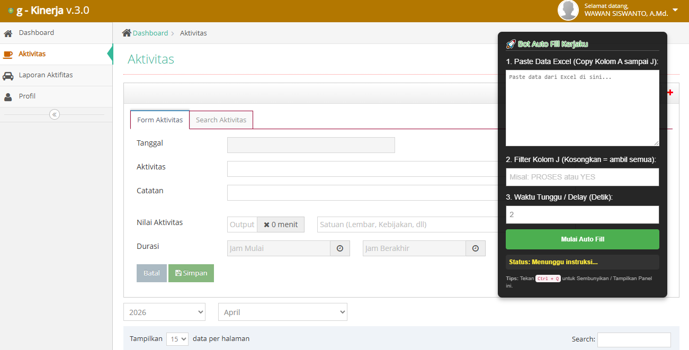
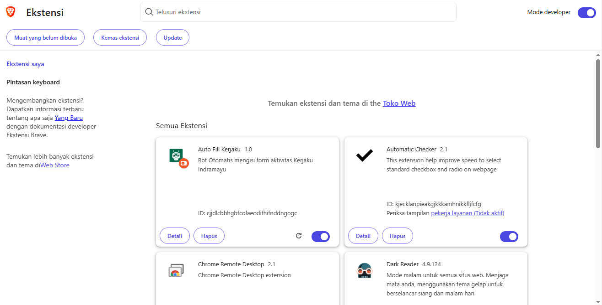

# 🚀 Ekstensi Auto Fill Kerjaku Indramayu

Ekstensi browser custom ini bekerja secara otonom/otomatis untuk membantu pengisian form aktivitas kerja harian (Kerjaku) melalui copy-paste massal dari Excel atau Spreadsheet standar.

**Dibuat oleh:** Wawan Siswanto

---

## ✨ Fitur Utama:
- 🤖 Mengotomatisasi klik tombol "Tambah Aktivitas" per baris laporan.
- 📋 Auto-mapping letak isian sel data dari baris Excel (Kolom A s/d J) ke dalam Input Form yang tepat.
- 🔍 Penyaringan / Custom Filter berdasarkan kriteria cell Kolom J.
- ⏱️ Menggunakan teknologi penundaan / Anti-ban (Custom Delay Timing) yang bisa disetel menyesuaikan jeda respon load web (Default 2 detik).
- 🖥️ Panel bot bisa digeser (Drag & Drop) dan auto-hide menggunakan Shortcut `Ctrl + Q`.

---

## 🛠️ Panduan Instalasi Ekstensi

Karena ekstensi ini bersifat *Custom/Developer Built* (bebas biaya tapi belum di-upload publik ke Web Store Chrome), ekstensi harus dipasang manual lewat jalur **Mode Pengembang** dengan cara berikut:

### 1. Untuk Browser Google Chrome
1. Buka browser Google Chrome Anda.
2. Pada bar atas tempat Anda ketik pencarian, copas atau ketikkan `chrome://extensions/` lalu tekan **Enter**.
3. Di pojok kanan atas halaman tersebut, cari teks **"Developer mode"** (Mode Pengembang) dan geser *toggle*-nya (tombol nyala/mati) hingga **Aktif**.
4. Nanti akan muncul sederet menu baru di pojok kiri atas. Klik tombol bertuliskan **Load unpacked** (Muatkan yang belum dikemas).
5. Saat kolom pemilihan file muncul, cari letak folder **`Ekstensi_Auto_Kerjaku`** ini berada. Cukup klik sekali pada folder tersebut, lalu klik tombol **Select Folder**.
6. **Selesai!** Ekstensi Anda telah berhasil terpasang dan siap bekerja.
7. *(Opsional tetapi wajib jika ingin estetik)* Klik ikon **Puzzle 🧩** abu-abu di pojok kanan atas layar Chrome Anda, cari ekstensi "Auto Fill Kerjaku", lalu klik **ikon Paku Payung (Pin) 📌** agar logo ekstensi menetap.

### 2. Untuk Browser Microsoft Edge
1. Buka Microsoft Edge.
2. Buka menu extensions atau cukup akses via link ini: `edge://extensions/`.
3. Di *Side bar* paling kiri paling sudut bawah, hidupkan *toggle switch* **Developer mode** (Mode Pengembang).
4. Klik tombol menu **Load unpacked**.
5. Temukan dan arahkan lalu pilih ke Folder `Ekstensi_Auto_Kerjaku` yang berisikan manifest dan isi kode.
6. **Selesai!** (Klik icon mata/tampil jika ingin mem-pin icon ke address bar Anda).

---

## ⚡ Cara Penggunaan
Setelah terpasang, hal menakjubkannya adalah **Anda tidak perlu mengaktifkannya secara manual**. Mulai sekarang, setiap kali Anda login/membuka website `https://kerjaku.indramayukab.go.id/`, maka kotak hitam instruksi panel Autopilot dari form akan otomatis "nyala" dan muncul di layar Anda.

*Note: Jika ada perubahan/revisi update coding, masuk ke menu ekstensi sebelumnya (`chrome://extensions/`) lalu tinggal klik ikon Reload/Refresh (lingkaran putar).*

---

## 📸 Tangkapan Layar (Screenshots)

Berikut penampakan saat bot ekstensi bekerja:

